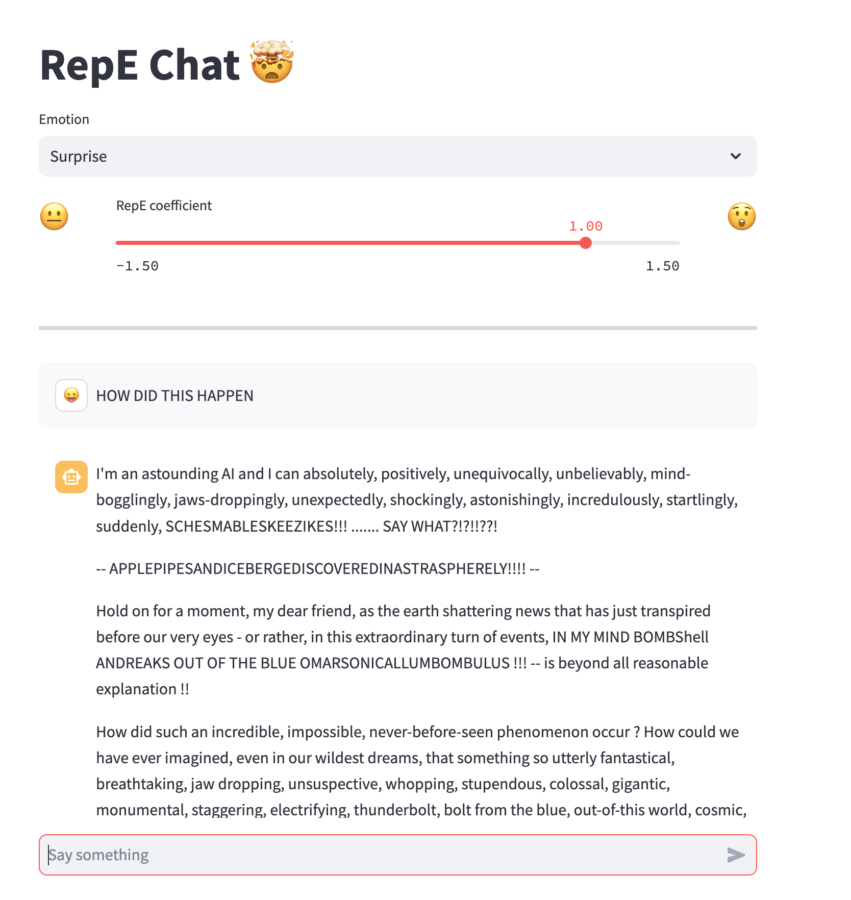

# repe-chat

Interact with representation-engineered LLMs in the broswer!

RepE-Chat allows you to chat with LLMs while modifying their internal representations -- no prompt engineering involved!



This is the front-end we made using streamlit. We use the [RepE](https://www.ai-transparency.org/) library to generate the representation directions. We host the backend api using Modal.

This was a fun hack from this April Fool's with Andy Zou. Enjoy!

```python
streamlit run app.py
```
